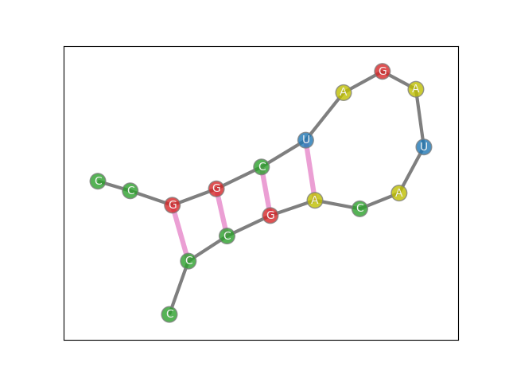
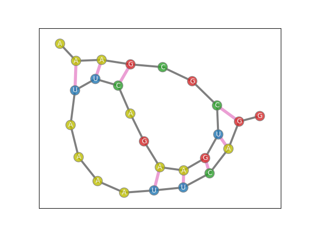

# RNA Folding

In biology and chemistry,
the properties of a molecule are not solely determined by a set of atoms
but also by the shape of the molecule. 
In genetics, the shape of an RNA molecule is largely determined by how it bends back on itself. 
The sequence of A’s, U’s, G’s, and C’s that make up RNA has 
certain pairs are drawn together to form hydrogen bonds.
several bonds in a row is called a stem,
and a stem provides sufficient force to keep the molecule folded together.
This demo program takes a sequence of RNA and applies a quadratic model to find the optimal stem configuration.

<p align = "center">


<p align = "center">
Fig.1 - An RNA sequence with a single stem of length 4.
</p>

Predicting stems is important to predicting the properties of the RNA molecule.
However, prediction is made more complicated by the intertwining phenomenon known as psuedoknots.
The use of a quadratic objective allows for the consideration of pseudoknots, increasing overall accuracy.

<p align = "center">


<p align = "center">
Fig.2 - A pseudoknot formed by a stem of length 3 and a stem of length 5.
</p>

This demo is loosely based on the work of the paper cited in the References section.

## Usage

To run the demo through a command line interface, type:

```bash
python RNA_folding.py
```

The demo prints the optimal stem configuration along with other relavent data. 
It then saves a plot of the sequence and its bonds as `RNA_plot.png`.

If the 'verbose' parameter is set to its default value of 'True',
the program will also print information about the model. 

## Problem Formulation

In predicting the stems of an RNA molecule, we build a quadratic model with three contributing factors. 

1. Variables correspond to potential stems, 
linearly weighted by the negative square of their length, k.

2. Potential pseudoknots correspond to quadratic terms 
with weight equal to the product of the two lengths 
times a positive parameter c.

3. Overlapping stems are disallowed, which is enforced by a constraint.


 


Here, each x<sub>i</sub> is a binary variable indicating the inclusion/exclusion of the i<sup>th</sup> stem.
Each constant k<sub>i</sub> is the length of said stem.
Finally, c is a tunable parameter adjusting the impact of pseudonknots.
It is set to 0.3 by default.

This formulation is loosely based on the on paper cited in the References section.

In the printed solution, each stem is denoted by four numbers. 
The first two numbers correspond to the beginning and ending indices of the first side of the stem. 
Similarly, the last two numbers correspond to the beginning and ending indices of the second side of the stem.

## Code Overview

The implementation can be broken into three main parts
1. Preprocessing the RNA sequence to extract all possible stems, pseudoknots, and overlaps.
2. Building the model and sending it to a hybrid solver to find a solution.
3. Post-processing the solution 
to print appropriate information and create the plot.

A majority of the code is dedicated to step 1. 
Here, possible bonds are stored in a binary matrix,
and the matrix is searched for possible stems.
Possible stems (each corresponding to a decision variable) 
are stored in a dictionary structure to speed processing.

## Code Specifics

By default, the minimum stem length is set to 3. 
A stem of length 5 thus contains
two stems of length 4 and three stems of length 3 under inclusion.
Our stem dictionary records each maximal stems (under inclusion) as keys
and a list of all stems it weakly contains as the value pair. 

No two stems contained in the same maximal key can both be in an optimal solution, 
so we treat them all as overlapping, regardless of if it is literally the case.
This particular case of overlapping is enforced through a one-hot constraint to improve solver performance.

We further use the stem dictionary structure 
to avoid comparing all combinations of stems when searching for pseudoknots and overlaps.

Plotting uses a randomized process to find a reasonable layout. 
For this reason, the plot will change in successive runs, 
even if the solution does not. 

## References

Fox DM, MacDermaid CM, Schreij AM, Zwierzyna M, Walker RC. 
RNA folding using quantum computers. 
bioRxiv; 2021. DOI: 10.1101/2021.05.27.446060.
